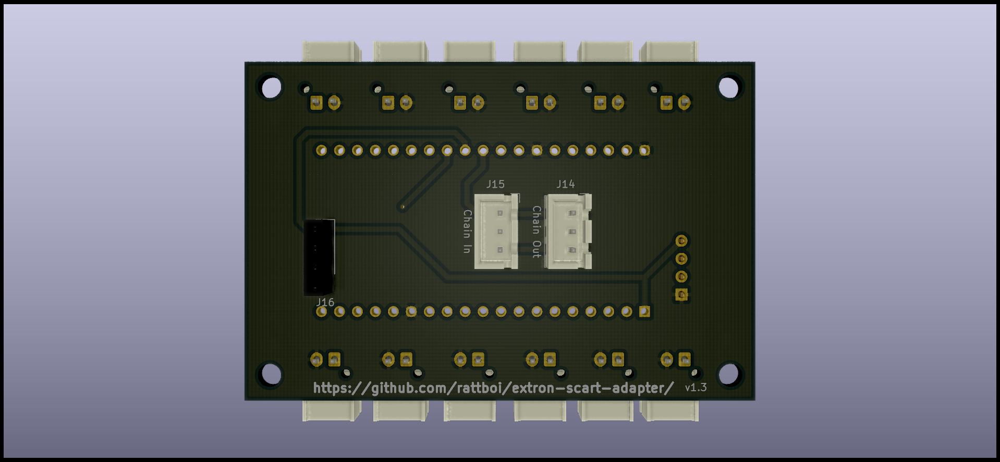

Extron SCART Autoswitcher
=========================

This board, in conjunction with a HiLetGo ESP-E32 development board, can be used to sense input changes from the Extron Input adapters, and use that information to automatically switch to the most recently turned-on input.

Each input board has a sense port, which you connect to the autoswitch board via a JST XH cable. The board then plugs into your extron either via straight-through M-F serial cable (not null modem), or by directly mounting the board onto the port. The ESP32 also needs external power, which can be supplied by any 5V USB charger that you may have laying around.

PCB
===

3D Renders
==========

PCB Renders
===========

BOM
===========
| Item | Qty | Reference(s)     | Value      | Footprint                                                   | Datasheet                                                                                                            |
|------|-----|------------------|------------|-------------------------------------------------------------|----------------------------------------------------------------------------------------------------------------------|
| WIP  |     |                  |            |                                                             |                                                                                                                      |

Code
====

The code for the autoswitcher is currently in micropython. The basic steps involved are as follows to get the board going.

1) Install any driver you may need for the usb->serial built into the ESP32. This is the CP2102 driver, and necessary for Windows and macOS. Linux comes with this driver pre-installed.

2) Plug the ESP32 into your computer, and find the serial device.
  This is straightforward in Linux/macOS, as it appears as /dev/ttyUSB0 or something close to that. I'm not actually sure what this looks like in windows.

3) Install the following programs to interact with the ESP32: esptool.py and ampy.
  esptool.py will allow you to flash micropython onto your ESP32
  ampy will allow you to move the boot code from this repo onto your ESP32 to be executed by micropython

4) Install micropython, some current revision.
  I'm not going to go through all the steps for this, but on Linux it looks something like `sudo esptool --chip esp32 -p /dev/ttyUSB0 write_flash -z 0x1000 ~/Downloads/esp32-20190328-v1.10-243-g92149c8a7.bin`
  `
5) Move the boot code over after micropython is installed
  `ampy -p /dev/ttyUSB0 put code/boot.py`

You're done now. Plug everything in. J1 -> Input 1, J2 -> Input 2, etc.

Congrats, now you have autoswitching power!
