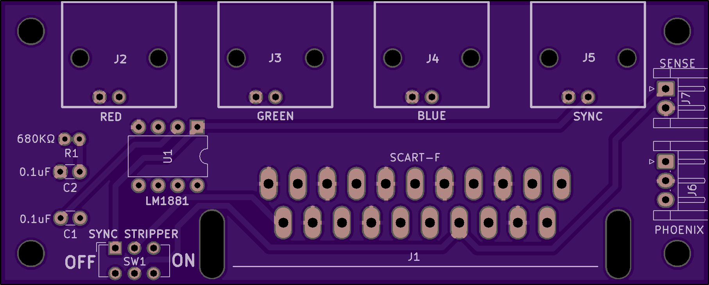
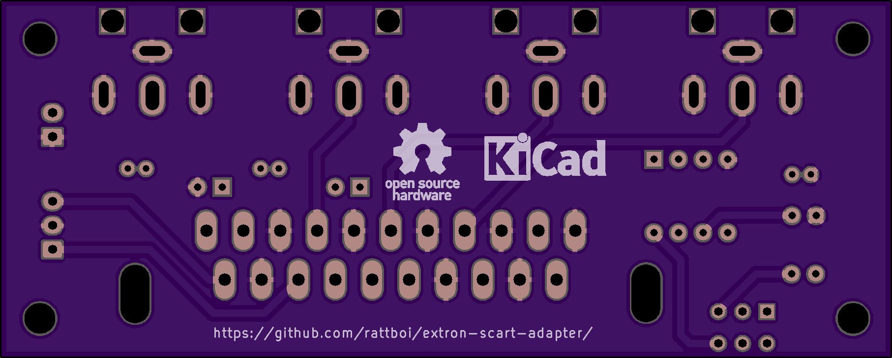

Extron SCART Input adapter
==========================

PCB Renders
===========

BOM (kinda)
===========

|Id             | Designator    |Package                                          |Quantity   |Designation     |Supplier and ref                                                                                                 | Unit Price | Total |
|---------------|---------------|-------------------------------------------------|-----------|----------------|-----------------------------------------------------------------------------------------------------------------|------------|-------|
|1              | SW1           |SW_CuK_JS202011AQN_DPDT_Angled                   |1          |SW_DPDT_x2      | Arrow: https://www.arrow.com/en/products/js202011aqn/ck                                                         | $0.40      |       |
|2              | C2,C1         |C_Disc_D3.0mm_W1.6mm_P2.50mm                     |2          |0.1uF           | Arrow                                                                                                           | cheap      |       |
|3              | J7            |JST_EH_B02B-EH-A_1x02_P2.50mm_Vertical           |1          |Conn_01x02_Male | Arrow: https://www.arrow.com/en/products/b3b-eh-a-lf-sn/jst-manufacturing                                       | $0.17      |       |
|4              | J6            |JST_EH_B03B-EH-A_1x03_P2.50mm_Vertical           |1          |Conn_01x03_Male | Arrow: https://www.arrow.com/en/products/b2b-xh-a-lf-sn/jst-manufacturing                                       | $0.14      |       |
|5              | U1            |DIP-8_W7.62mm                                    |1          |LM1881          | Arrow: https://www.arrow.com/en/products/lm1881nnopb/texas-instruments                                          | $3.34      |       |
|6              | R1            |R_Axial_DIN0204_L3.6mm_D1.6mm_P1.90mm_Vertical   |1          |680             | Arrow                                                                                                           | cheap      |       |
|7              | J5,J4,J3,J2   |BNC_90                                           |4          |Conn_Coaxial    | Arrow: https://www.arrow.com/en/products/415218-1/te-connectivity                                               | $1.79      | $7.20 |
|8              | J1            |SCART_F_RA                                       |1          |SCART-F         | Console5: https://console5.com/store/female-scart-jp21-through-hole-pcb-mount-21-pin-connector-right-angle.html | $1.79      |       |

Totals:
BOM: 13.04
PCB: $5 for 10, plus $6 for slower shipping

Cost for 1: 13.50+5+6+5 = $29.50 (not that much of a savings)
Cost for 10: $135+5+6+5 = $151 = $15.10 each (pretty good)

Other parts 
===========

Phoenix adapter
---------------
estimate is $8 for 10, + 0.14x10, so $9.40 for 10. $0.94 each

JST cables 
----------
https://www.amazon.com/HKBAYI-50Pair-50sets-Connector-WS2812B/dp/B00NBSH4CA/ 
$11 for 50

BNC M-M adapters
---------------
https://www.amazon.com/BeElion-15-Pack-Coaxial-Straight-Connector/dp/B01HMNJARQ/ 
$7.59 for 15
$22.50 for 45 (need 40 for 10x boards)

Totals for 10x boards
=====================
10x board + phoenix + cables + adapters: $151 + $10 + $11 + 22.50 = ~$195

$19.50 each, all parts, shipped
