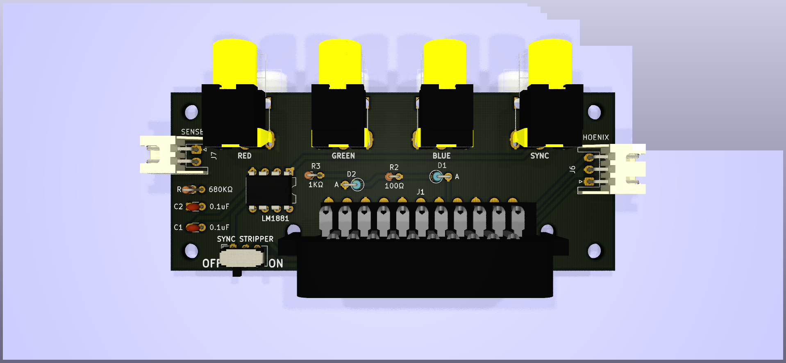
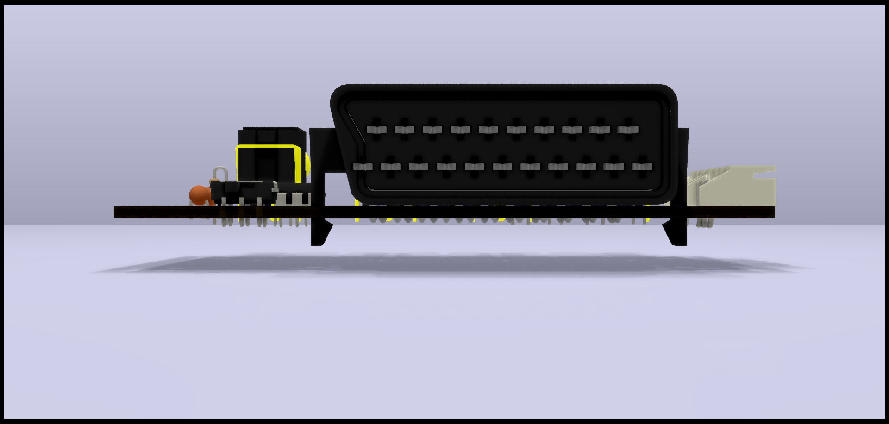
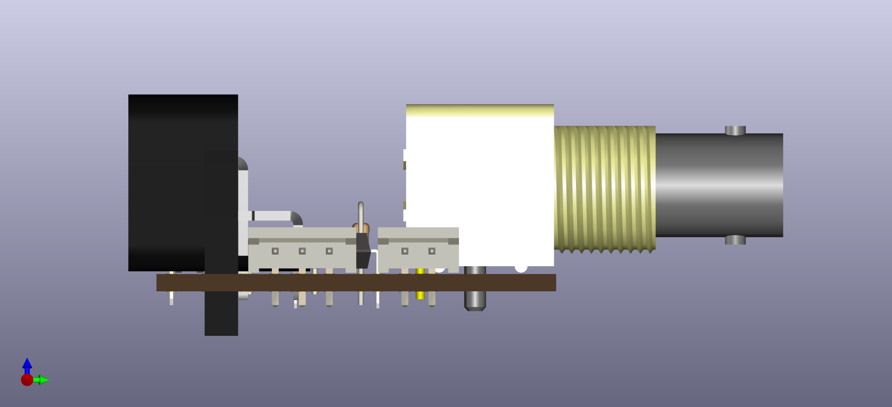

Extron SCART Input adapter
==========================

Note: This is out-of-date currently. It will be revised shortly.

PCB Renders
===========

3D Renders
==========

BOM (kinda)
===========
| Item | Qty | Reference(s)     | Value      | LibPart                      | Footprint                                                     | Datasheet                                                                                                            |
|------|-----|------------------|------------|------------------------------|---------------------------------------------------------------|----------------------------------------------------------------------------------------------------------------------|
| 1    | 2   | C1, C2           | 0.1uF      | Device:C_Small               | Capacitor_THT:C_Disc_D3.0mm_W1.6mm_P2.50mm,~                  | https://lcsc.com/product-detail/Multilayer-Ceramic-Capacitors-MLCC-Leaded_100nF-104-20-100V_C154503.html             |
| 2    | 1   | D1               | 1N4148     | Device:D_ALT                 | Diode_THT:D_DO-35_SOD27_P2.54mm_Vertical_AnodeUp,~            | https://lcsc.com/product-detail/Switching-Diode_1N4148_C14516.html                                                   |
| 3    | 1   | D2               | 1N4728A    | Device:D_Zener               | Diode_THT:D_DO-35_SOD27_P2.54mm_Vertical_AnodeUp,~            | https://lcsc.com/product-detail/Zener-Diodes_ON-Semicon_1N4728A_ON-Semicon-ON-1N4728A_C140852.html                   |
| 4    | 1   | J1               | SCART-F    | Connector:SCART-F            | extron-input:SCART_F_RA, ~                                    | https://console5.com/store/female-scart-jp21-through-hole-pcb-mount-21-pin-connector-right-angle.html                |
| 5    | 1   | J2               | RED        | Connector:Conn_Coaxial       | extron-input:rca_boom, ~                                      | https://lcsc.com/product-detail/AV-Connectors_AV-5_C18080.html                                                       |
| 6    | 1   | J3               | GREEN      | Connector:Conn_Coaxial       | extron-input:rca_boom, ~                                      | https://lcsc.com/product-detail/AV-Connectors_AV-5_C18080.html                                                       |
| 7    | 1   | J4               | BLUE       | Connector:Conn_Coaxial       | extron-input:rca_boom, ~                                      | https://lcsc.com/product-detail/AV-Connectors_AV-5_C18080.html                                                       |
| 8    | 1   | J5               | SYNC       | Connector:Conn_Coaxial       | extron-input:rca_boom, ~                                      | https://lcsc.com/product-detail/AV-Connectors_AV-5_C18080.html                                                       |
| 9    | 1   | J6               | PHOENIX    | Connector:Conn_01x03_Male    | Connector_JST:JST_XH_S03B-XH-A_1x03_P2.50mm_Horizontal,~      | https://lcsc.com/product-detail/XH-Connectors_JST_S3B-XH-A-LF-SN_XHsocket-1-3P-Curved-needle-pitch2-5mm_C157928.html |
| 10   | 1   | J7               | SENSE      | Connector:Conn_01x02_Male    | Connector_JST:JST_XH_S02B-XH-A_1x02_P2.50mm_Horizontal,~      | https://lcsc.com/product-detail/XH-Connectors_JST_S2B-XH-A-LF-SN_XHsocket-1-2P-Curved-needle-pitch2-5mm_C157931.html |
| 11   | 4   | J8, J9, J10, J11 | Conn_01x01 | Connector_Generic:Conn_01x01 | MountingHole:MountingHole_3.2mm_M3                            | N/A                                                                                                                  |
| 12   | 1   | J12              | RED        | Connector:Conn_Coaxial       | extron-input:rca_black, ~                                     | https://www.arrow.com/en/products/rcj-042/cui-inc                                                                    |
| 13   | 1   | J13              | GREEN      | Connector:Conn_Coaxial       | extron-input:rca_black, ~                                     | https://www.arrow.com/en/products/rcj-046/cui-inc                                                                    |
| 14   | 1   | J14              | BLUE       | Connector:Conn_Coaxial       | extron-input:rca_black, ~                                     | https://www.arrow.com/en/products/rcj-045/cui-inc                                                                    |
| 15   | 1   | J15              | SYNC       | Connector:Conn_Coaxial       | extron-input:rca_black, ~                                     | https://www.arrow.com/en/products/rcj-044/cui-inc                                                                    |
| 16   | 1   | R1               | 680KΩ      | Device:R_US                  | Resistor_THT:R_Axial_DIN0204_L3.6mm_D1.6mm_P1.90mm_Vertical,~ | https://lcsc.com/product-detail/Others_FlyWin-CR1-8W-5-680K-OTB5_C337028.html                                        |
| 17   | 1   | R2               | 100KΩ      | Device:R_US                  | Resistor_THT:R_Axial_DIN0204_L3.6mm_D1.6mm_P1.90mm_Vertical,~ | https://lcsc.com/product-detail/Carbon-Film-Resistors_100KR-104-5_C120103.html                                       |
| 18   | 1   | R3               | 1KΩ        | Device:R_US                  | Resistor_THT:R_Axial_DIN0204_L3.6mm_D1.6mm_P1.90mm_Vertical,~ | https://lcsc.com/product-detail/Carbon-Film-Resistors_1KR-102-5_C120055.html                                         |
| 19   | 1   | SW1              | SW_DPDT_x2 | Switch:SW_DPDT_x2            | Button_Switch_THT:SW_CuK_JS202011AQN_DPDT_Angled,             | https://lcsc.com/product-detail/Toggle-Switches_C-K_JS202011AQN_C-K-JS202011AQN_C221662.html                         |
| 20   | 1   | U1               | LM1881     | Video:LM1881                 | Package_DIP:DIP-8_W7.62mm,                                    | https://www.ti.com/store/ti/en/p/product/?p=LM1881N/NOPB&HQS=corp-tistore-null-storeinv-invf-store-octopart-wwe      |

Totals:
BOM: 13.04
PCB: $5 for 10, plus $6 for slower shipping

Cost for 1: 13.50+5+6+5 = $29.50 (not that much of a savings)
Cost for 10: $135+5+6+5 = $151 = $15.10 each (pretty good)

Other parts 
===========

Phoenix adapter
---------------
estimate is $8 for 10, + 0.14x10, so $9.40 for 10. $0.94 each

JST cables 
----------
https://www.amazon.com/HKBAYI-50Pair-50sets-Connector-WS2812B/dp/B00NBSH4CA/ 
$11 for 50

BNC M-M adapters
---------------
https://www.amazon.com/BeElion-15-Pack-Coaxial-Straight-Connector/dp/B01HMNJARQ/ 
$7.59 for 15
$22.50 for 45 (need 40 for 10x boards)

Totals for 10x boards
=====================
10x board + phoenix + cables + adapters: $151 + $10 + $11 + 22.50 = ~$195

$19.50 each, all parts, shipped
