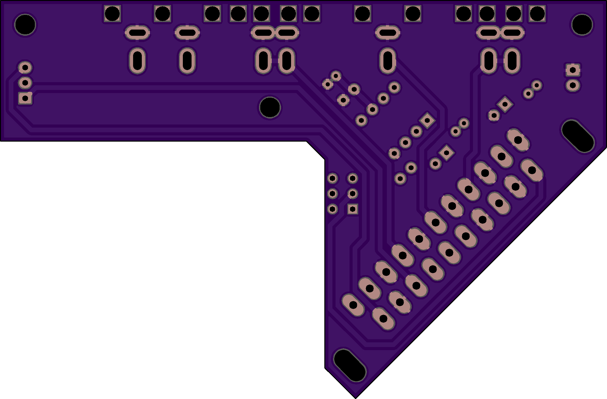
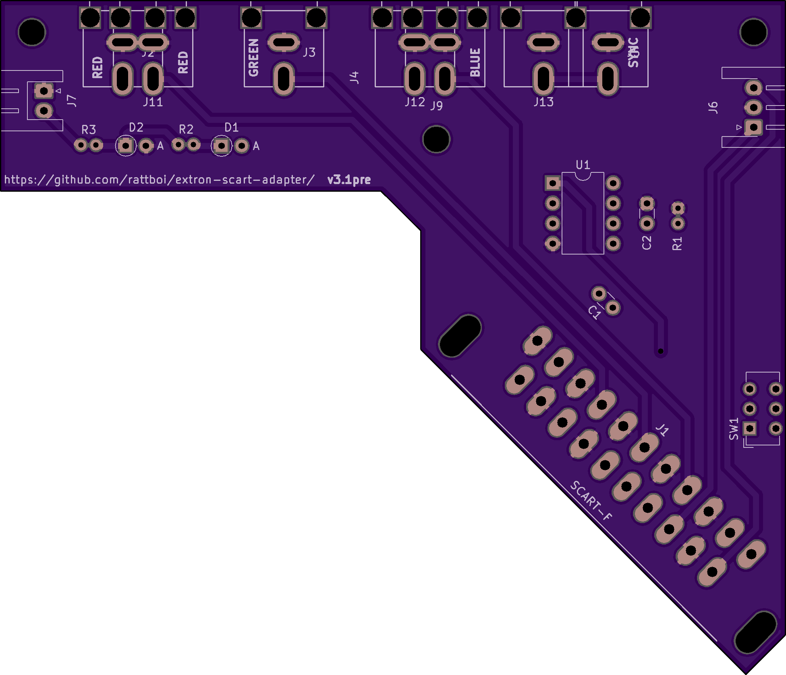
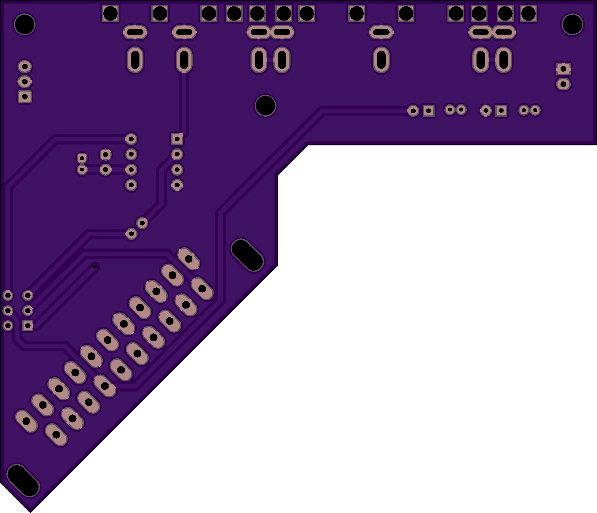
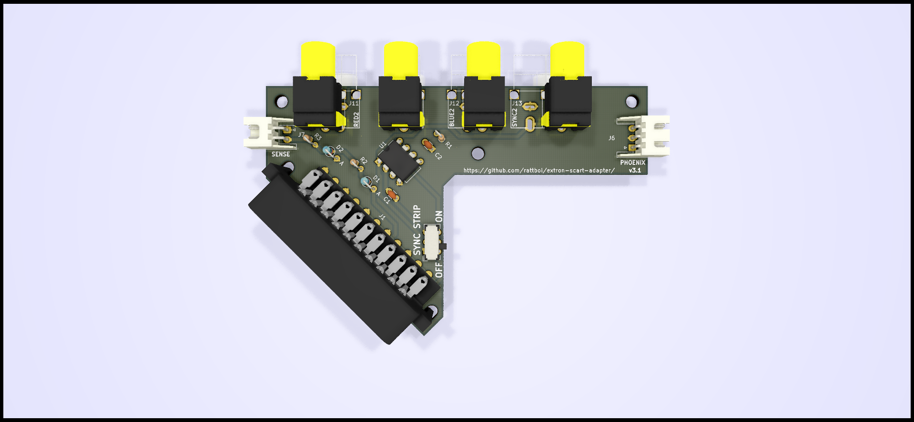
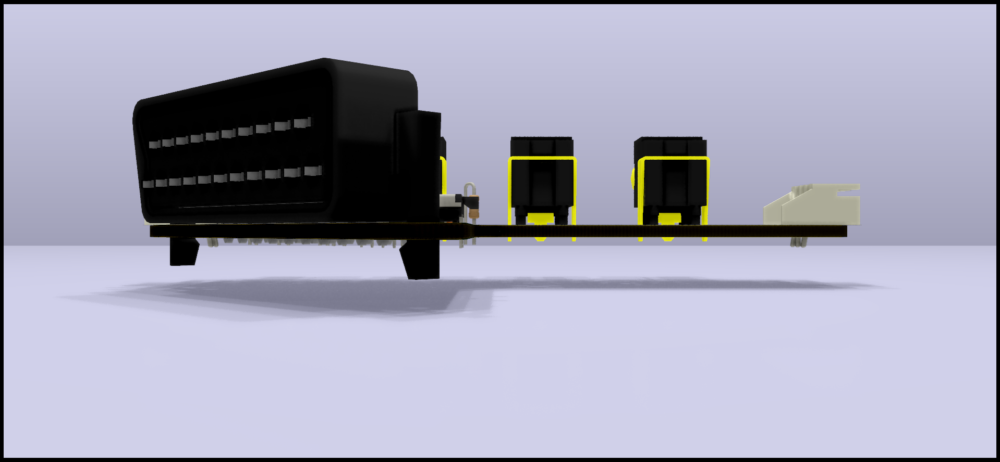
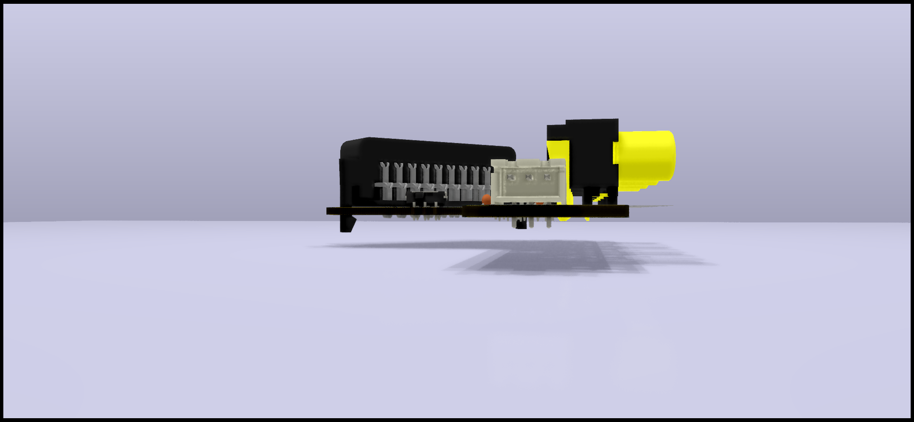
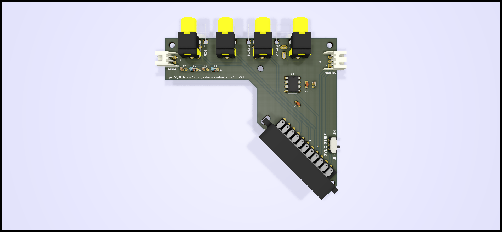
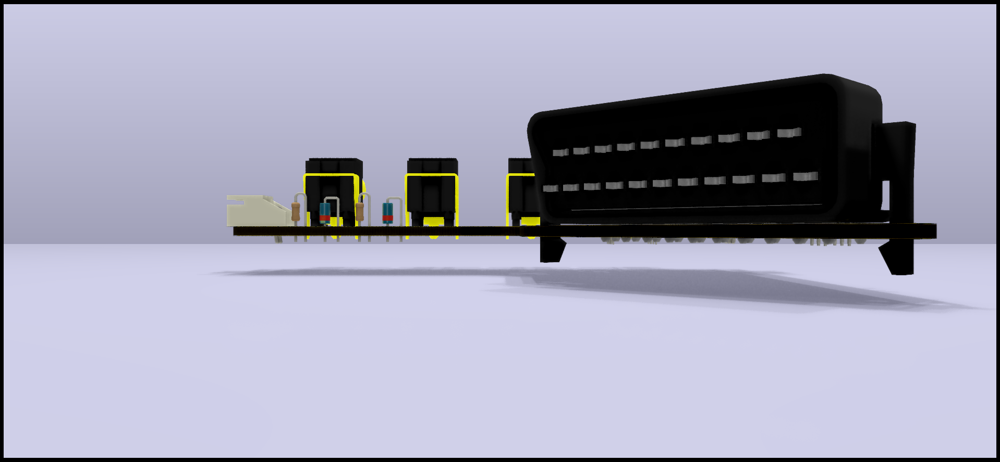
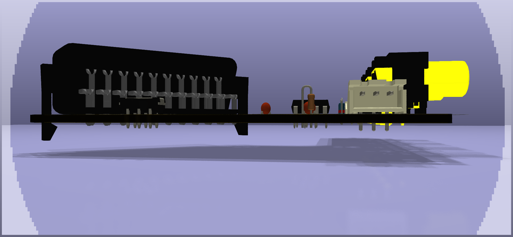

Extron SCART Input adapter
==========================

The Extron SCART Input adapters are designed to be inserted into an Extron Crosspoint input vertically, using BNC->RCA male adapters to mate with the adapter card's RCA female jacks. There are two supported BNC spacings, one that is looser (older Extrons) and one that is tighter (newer Extrons). When you assemble your card, you use the correct RCA spacing to support your Extron. The looser spacing is labeled RED1/GREEN/BLUE1/SYNC1, while the tighter spacing is labeled RED2/GREEN/BLUE2/SYNC2. You'll notice that GREEN is shared between the two spacings.

Below, you will notice that there is a design for a 'top' card and a 'bottom' card. This was required in order to get the cards close enough together horizontally (from the perspective of the Extron). The SCART heads are large and for the newer Extron spacing, the BNC spacing is just too tight to have the SCART heads stack. Therefore, you should plan to make both 'top' and 'bottom' cards, and alternate them. I use plastic standoffs to group 3-4 boards together. For the newer Extrons, I found that alternating 15mm and 16mm standoffs gave a perfect fit. Anothe alternative would be to just pair up boards, and use either 15 or 16. The error builds when you try to create a larger matrix, so you shouldn't have any problem if you make smaller matrices.

Features
========

The Extron input cards have optional sync strippers that are togglable via a switch that is labeled on the PCB. The lm1881 sync stripper is powered by the SCART cable's pin 8 (switch pin). The SCART standardsays that this should be carrying 5v-12v. Anywhere in that range works fine for the lm1881.

Also, there is a small custom circuit to determine if the console is powered on, via the switch pin on the SCART connector. This can be paired with the autoswitcher to automatically switch the extron input to match the last powered-on device. This circuit takes 5-12V and lowers it down to 2.5-3.3V, which is low enough to be a simple digital 'on' signal to the autoswitcher board.

PCB Renders
===========

## Top

## Bottom

3D Renders
==========

## Top

## Bottom

BOM
===========
| Item | Qty | Reference(s)     | Value      | Footprint                                                   | Datasheet                                                                                                            |
|------|-----|------------------|------------|-------------------------------------------------------------|----------------------------------------------------------------------------------------------------------------------|
| 1    | 2   | C1, C2           | 0.1uF      | Capacitor_THT:C_Disc_D3.0mm W1.6mm_P2.50mm                  | https://lcsc.com/product-detail/Multilayer-Ceramic-Capacitors-MLCC-Leaded_100nF-104-20-100V_C154503.html             |
| 2    | 1   | D1               | 1N4148     | Diode_THT:D_DO-35_SOD27 P2.54mm_Vertical_AnodeUp            | https://lcsc.com/product-detail/Switching-Diode_1N4148_C14516.html                                                   |
| 3    | 1   | D2               | 1N4728A    | Diode_THT:D_DO-35_SOD27 P2.54mm_Vertical_AnodeUp,~          | https://lcsc.com/product-detail/Zener-Diodes_ON-Semicon_1N4728A_ON-Semicon-ON-1N4728A_C140852.html                   |
| 4    | 1   | J1               | SCART-F    | extron-input:SCART_F_RA, ~                                  | https://console5.com/store/female-scart-jp21-through-hole-pcb-mount-21-pin-connector-right-angle.html                |
| 5    | 1   | J2/J11           | RED        | extron-input:rca_boom, ~                                    | https://lcsc.com/product-detail/AV-Connectors_AV-5_C18080.html                                                       |
| 6    | 1   | J3               | GREEN      | extron-input:rca_boom, ~                                    | https://lcsc.com/product-detail/AV-Connectors_AV-5_C18080.html                                                       |
| 7    | 1   | J4/J12           | BLUE       | extron-input:rca_boom, ~                                    | https://lcsc.com/product-detail/AV-Connectors_AV-5_C18080.html                                                       |
| 8    | 1   | J5/J13           | SYNC       | extron-input:rca_boom, ~                                    | https://lcsc.com/product-detail/AV-Connectors_AV-5_C18080.html                                                       |
| 9    | 1   | J6               | PHOENIX    | Connector_JST:JST_XH_S03B XH-A_1x03_P2.50mm_Horizontal,~    | https://lcsc.com/product-detail/XH-Connectors_JST_S3B-XH-A-LF-SN_XHsocket-1-3P-Curved-needle-pitch2-5mm_C157928.html |
| 10   | 1   | J7               | SENSE      | Connector_JST:JST_XH_S02B XH-A_1x02_P2.50mm_Horizontal,~    | https://lcsc.com/product-detail/XH-Connectors_JST_S2B-XH-A-LF-SN_XHsocket-1-2P-Curved-needle-pitch2-5mm_C157931.html |
| 11   | 4   | J8, J9, J10, J11 | Conn_01x01 | MountingHole:MountingHole_3.2mm_M3                          | N/A                                                                                                                  |
| 12   | 1   | R1               | 680KΩ      | Resistor_THT:R_Axial_DIN0204 L3.6mm_D1.6mm_P1.90mm_Vertical | https://lcsc.com/product-detail/Others_FlyWin-CR1-8W-5-680K-OTB5_C337028.html                                        |
| 13   | 1   | R2               | 100KΩ      | Resistor_THT:R_Axial_DIN0204 L3.6mm_D1.6mm_P1.90mm_Vertical | https://lcsc.com/product-detail/Carbon-Film-Resistors_100KR-104-5_C120103.html                                       |
| 14   | 1   | R3               | 1KΩ        | Resistor_THT:R_Axial_DIN0204 L3.6mm_D1.6mm_P1.90mm_Vertical | https://lcsc.com/product-detail/Carbon-Film-Resistors_1KR-102-5_C120055.html                                         |
| 15   | 1   | SW1              | SW_DPDT_x2 | Button_Switch_THT:SW_CuK JS202011AQN_DPDT_Angled,           | https://lcsc.com/product-detail/Toggle-Switches_C-K_JS202011AQN_C-K-JS202011AQN_C221662.html                         |
| 16   | 1   | U1               | LM1881     | Package_DIP:DIP-8_W7.62mm,                                  | https://www.ti.com/store/ti/en/p/product/?p=LM1881N/NOPB

LCSC     Sub-total: __$14.94__ for everything for 10x boards (plus lots of spare parts)

Console5 Sub-total: __$14.90__ for RA Female SCART connectors

TI       Sub-total: __$28.40__ for LM1881n 

BOM Total for 10x boards: __$58.40__ plus Console5/TI shipping

BOM Total with shipping: __~$70__

You'll want 5x of the top boards and 5x of the bottom boards
PCBs: __$4 for 5__ top, __$4 for 5__ bottom, plus $6 for slower shipping = __$14__

Cost for 10 boards, all parts: $70+14 = $84 = __$8.40__ each

Other Supporting Parts 
======================

Phoenix adapter (for audio)
---------------------------

I've respun db_electronics' Phoenix RCA plug board to use JST headers: https://github.com/rattboi/phoenix-audio-adapter-kicad/tree/jst-xh/

$5 for 10x more boards on JLCPCB order, and $0.89 for JST headers

__$5.89__ for 10x populated boards = __$0.59 each__

JST cables (connect input audio to phoenix board)
----------
https://www.amazon.com/gp/product/B07HRMWVK9/

__$8 for 10__(need to find a better source)

BNC M to RCA M Plug Adapters
---------------
https://www.amazon.com/gp/product/B005C2KA88/

$5.39 for 10

__$21.56 for 40__ (4x per board, 10 boards)

Alternative: 

https://www.amazon.com/gp/product/B01H1A4QAQ/

$6.42 for 10

$25.68 for 40

10x board Total
===============
10x board + phoenix + cables + adapters: $84 + $6 + $8 + $22 = __~$120__

__$12 each, all parts, shipped__

10x boards Stripped-down 
------------------------

If you were to remove the optional components (no sync stripper, no sense circuit), you can get the price down further

Removing switch + lm1881 and passives for lm1881 + passives for sense circuit + sense connector: 

LCSC     Sub-total: $7.06

Console5 Sub-total: $14.90 for SCART connectors

BOM Total with shipping: $7.06 + $14.90 + $5 = $27

PCBS are the same, so $14 for 10x boards shipped

The rest of the parts are the same

10x board + phoenix + cables + adapters: $41 + $3 + $8 + $23 = __~$75__

__$7.50 each, stripped-down, shipped__
