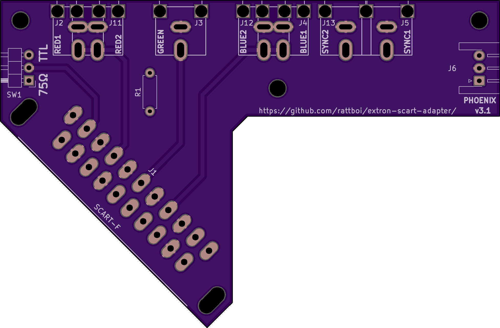
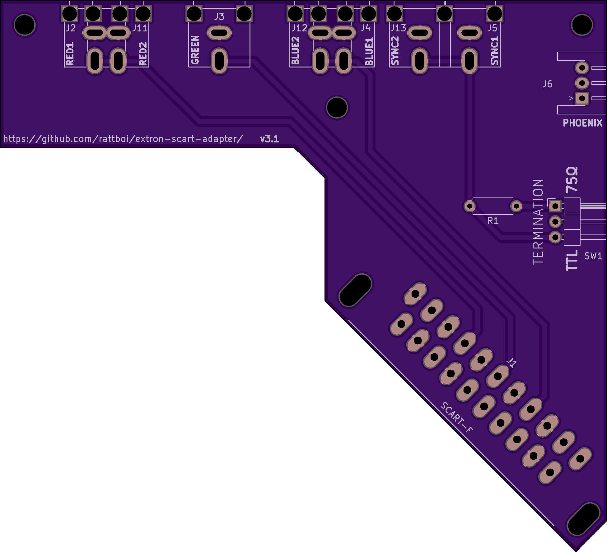
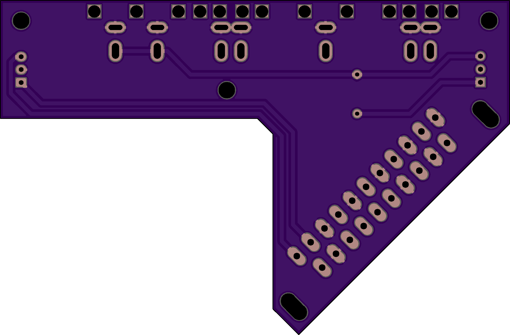
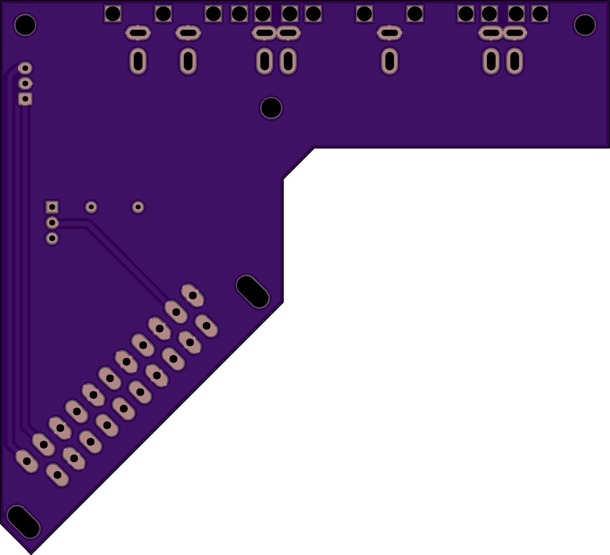
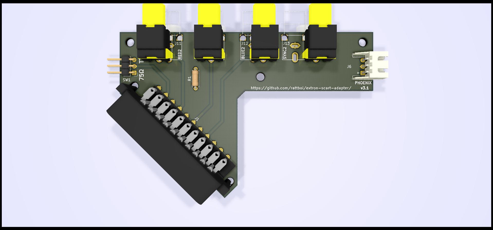
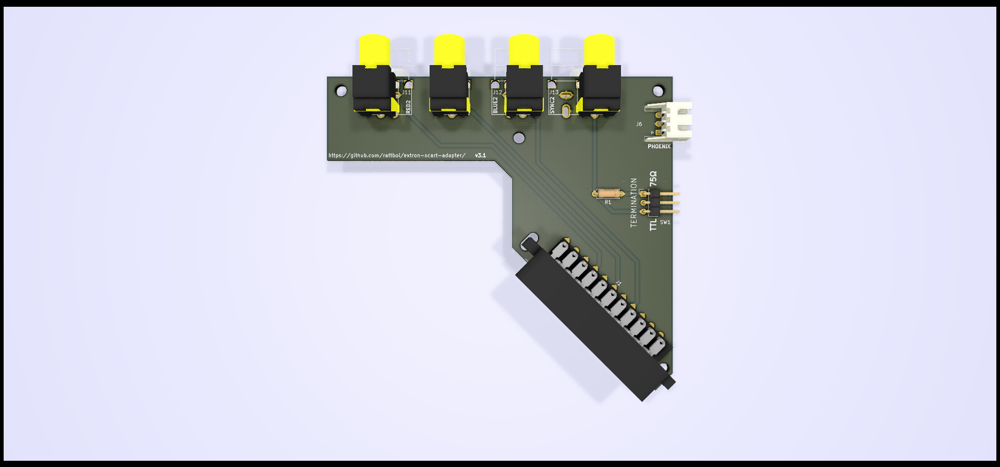
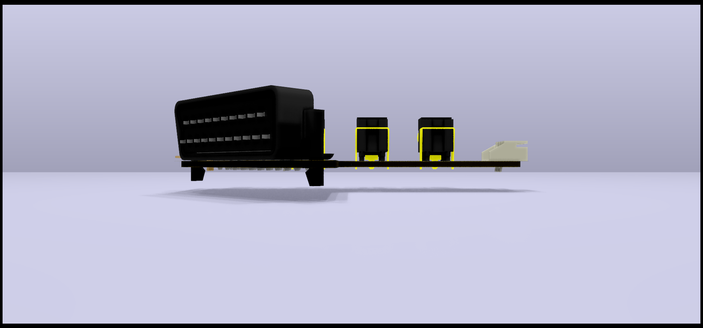
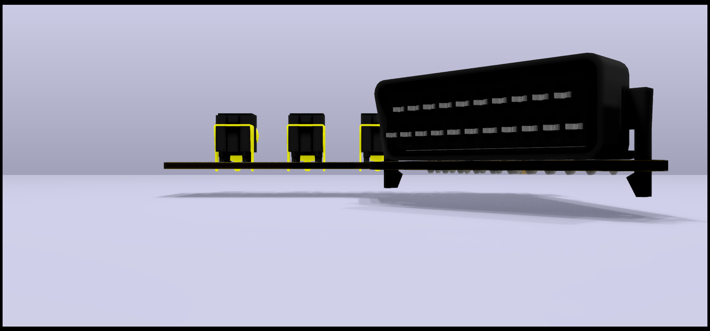
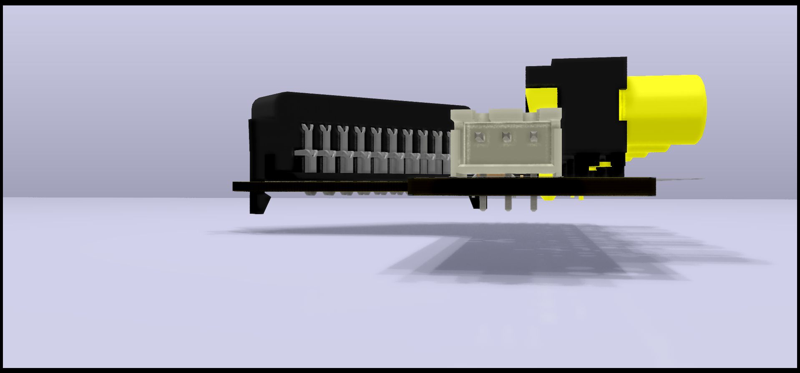
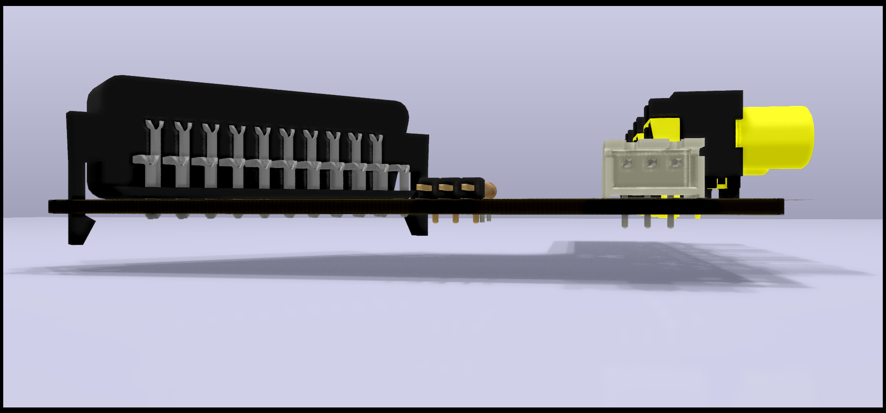

Extron SCART Output Adapter
==========================

PCB Renders
===========

## Front

## Back

3D Renders
==========

## Top

## Front

## Side

BOM 
===

| Item | Qty | Reference(s)     | Value      | Footprint                                                   | Datasheet                                                                                                            |
|------|-----|------------------|------------|-------------------------------------------------------------|----------------------------------------------------------------------------------------------------------------------|
| 1    | 1   | J1               | SCART-F    | extron-input:SCART_F_RA, ~                                  | https://console5.com/store/female-scart-jp21-through-hole-pcb-mount-21-pin-connector-right-angle.html                |
| 2    | 1   | J2/J11           | RED        | extron-input:rca_boom, ~                                    | https://lcsc.com/product-detail/AV-Connectors_AV-5_C18080.html                                                       |
| 3    | 1   | J3               | GREEN      | extron-input:rca_boom, ~                                    | https://lcsc.com/product-detail/AV-Connectors_AV-5_C18080.html                                                       |
| 4    | 1   | J4/J12           | BLUE       | extron-input:rca_boom, ~                                    | https://lcsc.com/product-detail/AV-Connectors_AV-5_C18080.html                                                       |
| 5    | 1   | J5/J13           | SYNC       | extron-input:rca_boom, ~                                    | https://lcsc.com/product-detail/AV-Connectors_AV-5_C18080.html                                                       |
| 6    | 1   | R1               | 470        | R_Axial_DIN0204_L3.6mm D1.6mm_P1.90mm_Vertical              | https://lcsc.com/product-detail/Metal-Film-Resistor-TH_470R-471-5_C176518.html                                       |
| 7    | 1   | J6               | PHOENIX    | Connector_JST:JST_XH_S03B XH-A_1x03_P2.50mm_Horizontal,~    | https://lcsc.com/product-detail/Wire-To-Board-Wire-To-Wire-Connector_JST-Sales-America_S3B-XH-A-LF-SN_JST-Sales-America-S3B-XH-A-LF-SN_C157928.html |
| 8    | 1   | SW1              | CSYNC      | 3x1 Pin Header                                              | (fill me in)                                                                                                         |

LCSC     Sub-total: __$6.76__ for everything for 10x boards (plus lots of spare parts)
Console5 Sub-total: __$14.90__ for RA Female SCART connectors
BOM Total: __$21.66__ for 10x boards

You'll want 5x of the top boards and 5x of the bottom boards
PCBs: __$4 for 5__ top, __$4 for 5__ bottom, plus $6 for slower shipping = __$14__

Total board Costs for 10: $21.66+14 = $35.66 =  $3.57 each (pretty cheap)

Other Supporting Parts 
======================

Phoenix adapter (for audio)
---------------------------

I've respun db_electronics' Phoenix RCA plug board to use JST headers: https://github.com/rattboi/phoenix-audio-adapter-kicad/tree/jst-xh/

$5 for 10x more boards on JLCPCB order, and $0.89 for JST headers

__$5.89__ for 10x populated boards = __$0.59 each__

JST cables (connect input audio to phoenix board)
----------
https://www.amazon.com/gp/product/B07HRMWVK9/

__$8 for 10__(need to find a better source)

BNC M to RCA M Plug Adapters
---------------
https://www.amazon.com/gp/product/B005C2KA88/

$5.39 for 10

__$21.56 for 40__ (4x per board, 10 boards)

Alternative: 

https://www.amazon.com/gp/product/B01H1A4QAQ/

$6.42 for 10

$25.68 for 40

10x board Total
===============
10x board + phoenix + cables + adapters: $36 + $6 + $8 + $22 = __~$72__

__$7.20 each, all parts, shipped__
