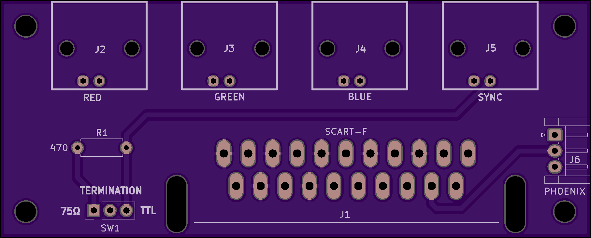
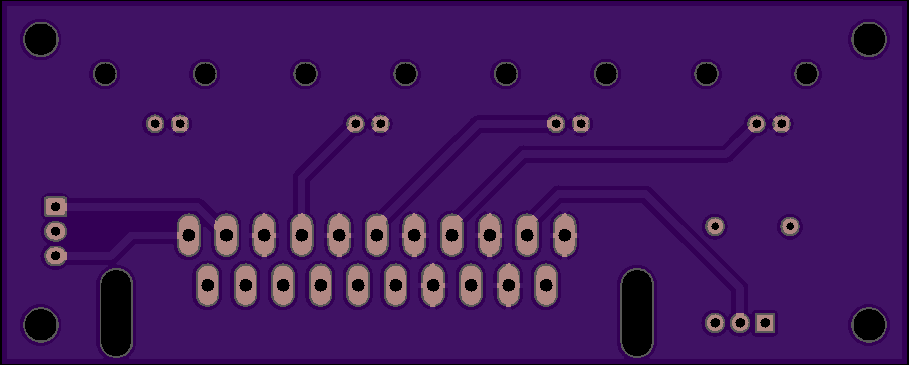
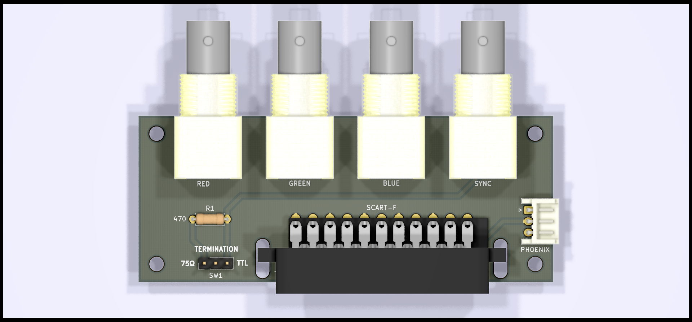
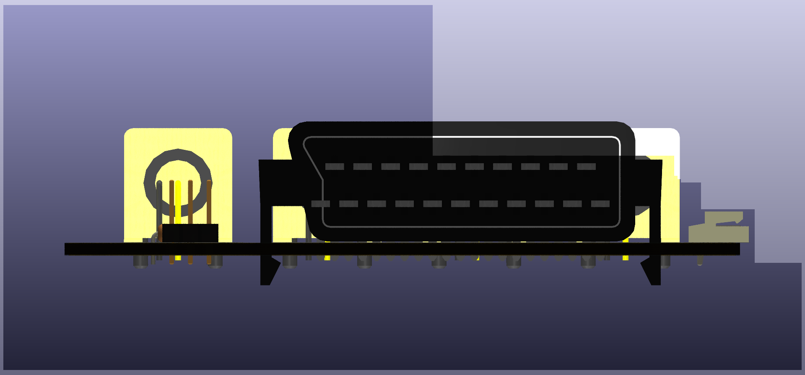

Extron SCART Output Adapter
==========================

PCB Renders
===========

3D Renders
==========

BOM 
===

|Id             | Designator    |Package                                          |Qty   |Designation     |Supplier and ref                                                                                                 | Unit Price | Total |
|---------------|---------------|-------------------------------------------------|------|----------------|-----------------------------------------------------------------------------------------------------------------|------------|-------|
|1              | SW1           |3x1 Pin Header                                   |1     |                | Arrow:                                                                                                          | cheap      |       |
|2              | J6            |JST_EH_B03B-EH-A_1x03 P2.50mm_Vertical           |1     |Conn_01x03_Male | Arrow: https://www.arrow.com/en/products/b2b-xh-a-lf-sn/jst-manufacturing                                       | $0.14      |       |
|3              | R1            |R_Axial_DIN0204_L3.6mm D1.6mm_P1.90mm_Vertical   |1     |470             | Arrow                                                                                                           | cheap      |       |
|4              | J5,J4,J3,J2   |BNC_90                                           |4     |Conn_Coaxial    | Arrow: https://www.arrow.com/en/products/415218-1/te-connectivity                                               | $1.79      | $7.20 |
|5              | J1            |SCART_F_RA                                       |1     |SCART-F         | Console5: https://console5.com/store/female-scart-jp21-through-hole-pcb-mount-21-pin-connector-right-angle.html | $1.79      |       |

Totals:
BOM: 9.50
PCB: $5 for 10, plus $6 for slower shipping

Cost for 1: 9.50+5+6+5 = $25.50 (not that much of a savings)
Cost for 10: $95+5+6+5 = $111 = $11.10 each (pretty good)

Other parts 
===========

Phoenix Adapter
---------------
estimate is $8 for 10, + 0.14x10, so $9.40 for 10. $0.94 each

JST cables 
----------
https://www.amazon.com/HKBAYI-50Pair-50sets-Connector-WS2812B/dp/B00NBSH4CA/ 
$11 for 50

BNC M-M adapters
---------------
https://www.amazon.com/BeElion-15-Pack-Coaxial-Straight-Connector/dp/B01HMNJARQ/ 
$7.59 for 15
$22.50 for 45 (need 40 for 10x boards)

Totals for 10x boards
=====================
10x board + phoenix + cables + adapters: $111 + $10 + $11 + 22.50 = ~$155

$15.50 each, all parts, shipped
