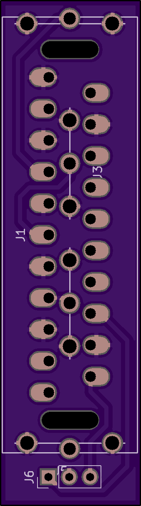

SPACING IS WRONG - DONT USE
===========================

This is just here for posterity. I may remove it later

Idea: Design a PCB that can mount directly to an extron 4x BNC input, on the cheap, and without cables (mostly).

To make this possible, use the following:

1) 4x pcb-mountable RCA female connectors (R, G, B, H)  
https://www.digikey.com/product-detail/en/cui-inc/RCJ-021/CP-1406-ND/408493

2) 4x rca male to BNC male adapters
https://www.amazon.com/Hosyl-Male-Plug-Adapters-Pack/dp/B01H1A4QAQ/

3) A pcb-mountable female SCART connector
https://www.mouser.com/ProductDetail/Kycon/K-SCARTX-024?qs=BXFTyIlnqNt1WE8CDO1Pgg%3D%3D

4) A PCB with SCART connector on one side, and the RCA female connectors (very accurately placed) on the other side

Put adapters down your BNC input line on the extron so you have 4x rca male instead. 

Plug this PCB's 4x rca female plugs into those 4x rca male jacks.

Now you have a SCART input!

Based on some napkin math, it'd be about $10/input for this configuration. It's closer to $12/input when adding in phoenix adapters for audio.

Future ideas:

Extron gear requires csync, so probably need an option to add a sync stripper circuit for whatever is on SCART pin 20.

Not sure the best way to do this, but if you had sense lines to each board going to a raspberry pi, you could auto-switch using the RS-232 on the extron. One can dream...
